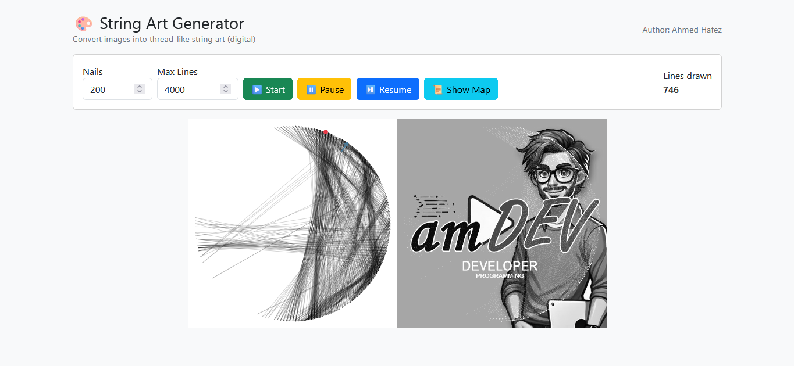
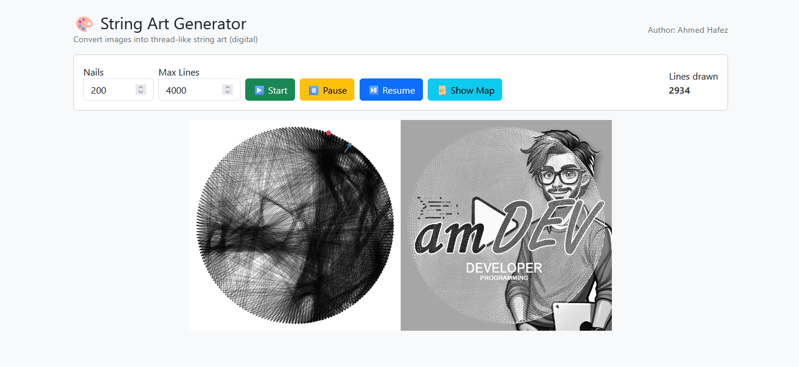
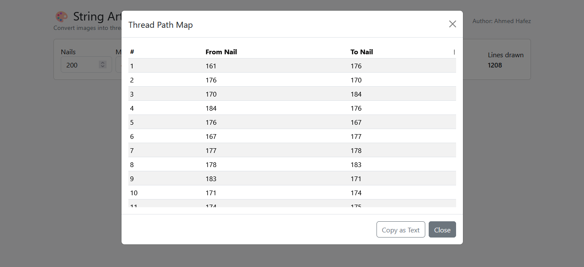

# 🧵 StringArt

**StringArt** — A creative web app that simulates the classic **string art technique**, where an image is transformed into a set of lines connecting pins arranged around a circle.

[](https://amdevtech.github.io/StringArt/)
[](LICENSE)

---

## Summary

StringArt allows you to load an image, place pins in a circular arrangement, and generate line art that connects the pins based on the brightness of the image. You can control the number of pins, adjust line colors, pause/resume the process, and even export the generated artwork as an image.

---

## Screenshot







---

## Explanation of use

1. **Start** — begin generating the string art lines.
2. **Pause / Resume** — pause the drawing and continue later without losing progress.
4. **Export** — save the generated artwork as an image at any moment.
5. **Table of Lines** — shows connections between pins with their colors.

---

## How the project is packaged

- The app is implemented as two files: `index.html` and `sketch.js`.
- The interface is styled with **Bootstrap** for better controls and layout.
- The app runs completely in the browser with no backend required.

---

## Usage (Quick start)

1. Clone the repository or download the project files.
2. Open `index.html` in your browser.
3. Click **Start** to begin generating the string art.
4. Use controls to pause, resume, or export your artwork.

---

## Roadmap

### ✅ Completed tasks
- Pin numbering (partial, 4 per quarter).
- Pause / Resume functionality.
- Export generated artwork as an image.
- Line table with color column.

### 🚧 Planned / To-do tasks
- Allow changing line color per connection individually.
- Line color change with real-time update.
- Add option to **change the input image** dynamically.
- Add support for **different shapes** (square, rectangle, etc.).

---

## File structure

```
/ (repo root)
├─ index.html        # main HTML file
├─ sketch.js
├─ assets/
│  └─ screenshot01.png
└─ README.md
```

---

## Author
**Ahmed Hafez** — StringArt
